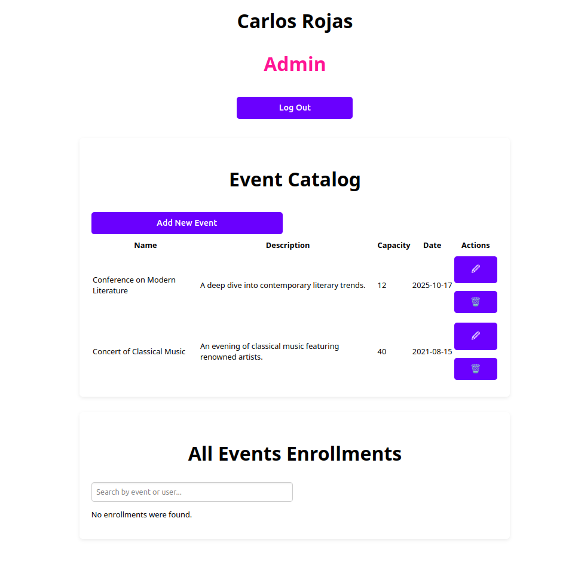
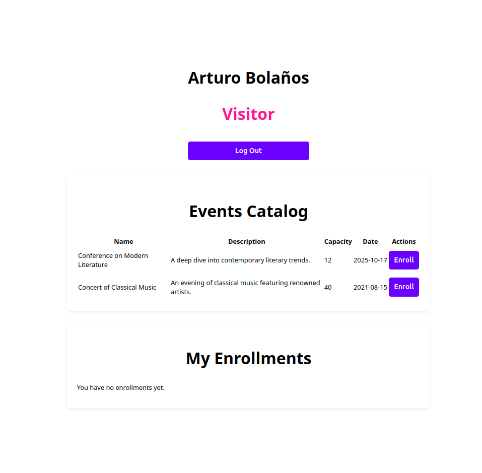

# 📅 Event Management SPA

> 📄 This README is also available in [Spanish 🇪🇸](README.es.md)

A simple and interactive Single Page Application (SPA) built with vanilla JavaScript, HTML, and CSS. Users can register, log in, enroll in events, and manage enrollments. Admins can add, edit, and delete events. Uses `json-server` as a mock backend.

---

## 🖼️ Preview

View of the SPA as an Admin (role: `Admin`).



View of the SPA as a visitor (role: `Visitor`).



---

## 🎯 Key Features

- User registration and login with role validation.
- Interface adapts to a user role (`Visitor` or `Admin`).
- Event enrolls with automatic stock updates.
- Cancel enrolls.
- Full CRUD for events (Admins only).
- Global view of enrollments with filters by event or user.

---

## 🚀 How to Run the Project

### 1. Clone the Repository

```bash
git clone https://github.com/Carturo8/js-test
```

### 2. Install Dependencies

```bash
npm install
```

### 3. Start the Simulated Backend (json-server)

```bash
npm run server
```

This will launch a JSON server at: [http://localhost:3000](http://localhost:3000)

### 4. Start the Application

In another terminal, run:

```bash
npm run dev
```

This will start the SPA in development mode using Vite. Open your browser at: [http://localhost:5173](http://localhost:5173)

---

## 🧭 How the App Works

### 1. Home Page

- Displays two buttons: **Log In** and **Register**.
- Direct navigation to protected routes is blocked if not logged in.

### 2. User Registration

- Anyone can register with:
    - Name
    - Email
    - Password
    - Role (`Visitor`)
- The email must be unique.
- After registering, the session is saved and the user is redirected to the dashboard.

### 3. Login

- User must enter email and password.
- If credentials are valid, the user is redirected to the dashboard.

---

## 🖥️ Dashboard (Main Panel)

The content varies depending on the **user role**:

### 👤 Role: Visitor

- **Events Catalog**: Lists all registered events.
    - If an event has capacity (`capacity > 0`) and hasn't been enrolled by the user, it can be **enrolled**.
    - When enrolling:
        - The capacity count decreased by 1.
        - The enrolling is stored for the user.
- **My Enrollments**: shows events enrolled by the visitor.
    - Enrollments can be canceled (increasing capacity).

### 🛡️ Role: Admin

- **Events Catalog**:
    - Lists all registered events.
    - Allows creation, editing, and deletion of events.
    - Deleting an event also removes its enrollment.
- **All Event Enrollments**:
    - Displays a grouped list of enrollments by event.
    - Supports filtering by event name or user.
    - Each group shows the event and users who enrolled in it.

---

## 🧪 Test Credentials

### Librarian
- Email: `carlos@admin.com`
- Password: `admin123`

### Visitor
- Email: `arturo@visitor.com`
- Password: `visitor123`

---

## 🛠️ Technologies Used

- **Vite** for development tooling.
- **HTML5** and **CSS3** for structure and styling.
- **Vanilla JavaScript** (no frameworks).
- **json-server** for a mock backend.
- **SweetAlert2** for interactive alerts.

---

## 📁 Project Structure

```
project-root/
├── public/                      # Public static files
├── src/                         # Main source code
│   ├── assets/                  # Static assets (e.g., images)
│   │   └── img/
│   ├── auth/                    # User login and registration
│   │   ├── login.js
│   │   └── register.js
│   ├── enrollments/             # Enrollment features
│   │   ├── enrollmentAdmin.js
│   │   ├── enrollmentList.js
│   │   └── myEnrollments.js
│   ├── events/                  # Event management
│   │   ├── eventForm.js
│   │   └── eventList.js
│   ├── router/                  # SPA routing system
│   │   └── router.js
│   ├── services/                # API functions
│   │   └── api.js
│   ├── utils/                   # Helpers (e.g., session management)
│   │   └── session.js
│   ├── views/                   # Main views
│   │   ├── dashboard.js
│   │   ├── home.js
│   │   └── not-found.js
│   ├── main.js                  # Main entry point
│   └── style.css                # Global styles
├── .gitinore                    # Git ignored files
├── db.json                      # Mock database (json-server)
├── index.html                   # Main HTML file
├── LICENSE                      # License file
├── package.json                 # Project dependencies and scripts
├── package-lock.json            # Locked dependencies
├── README.es.md                 # README in Spanish
└── README.md                    # This file
```

---

## ⚙️ Prerequisites

- Node.js ≥ 18
- npm ≥ 9

---

## 📌 Additional Notes

- Session is stored in `localStorage`.
- Users can't enroll in the same event more than once.

## 📝 License

This project is licensed under the [MIT License](LICENSE).
